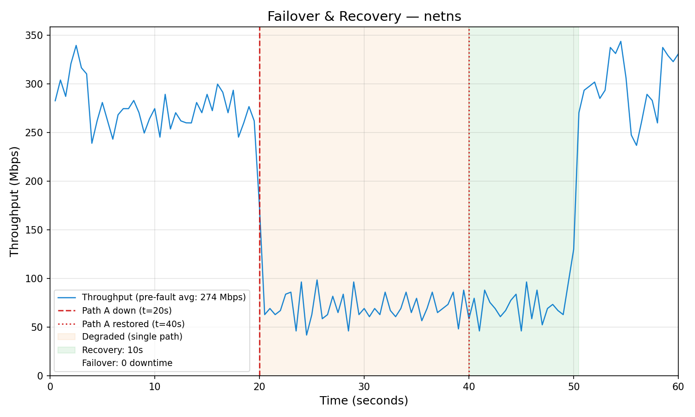
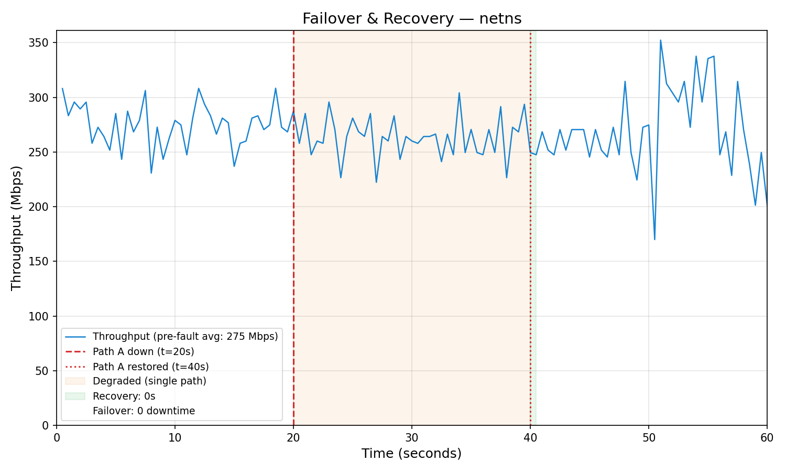
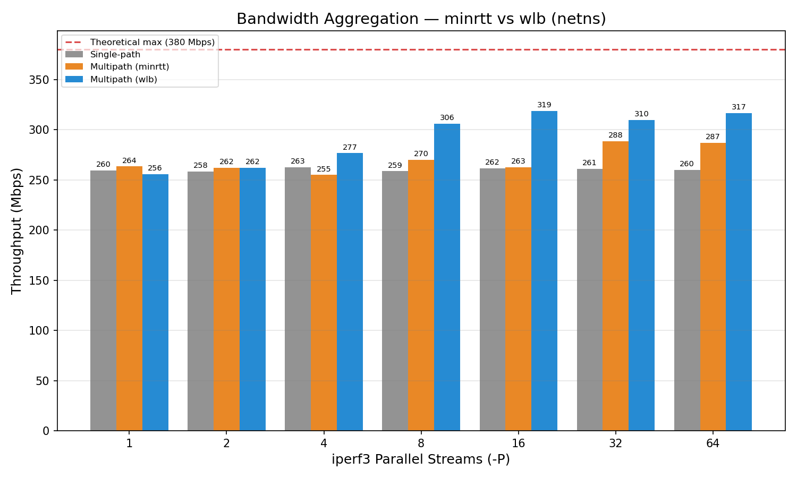
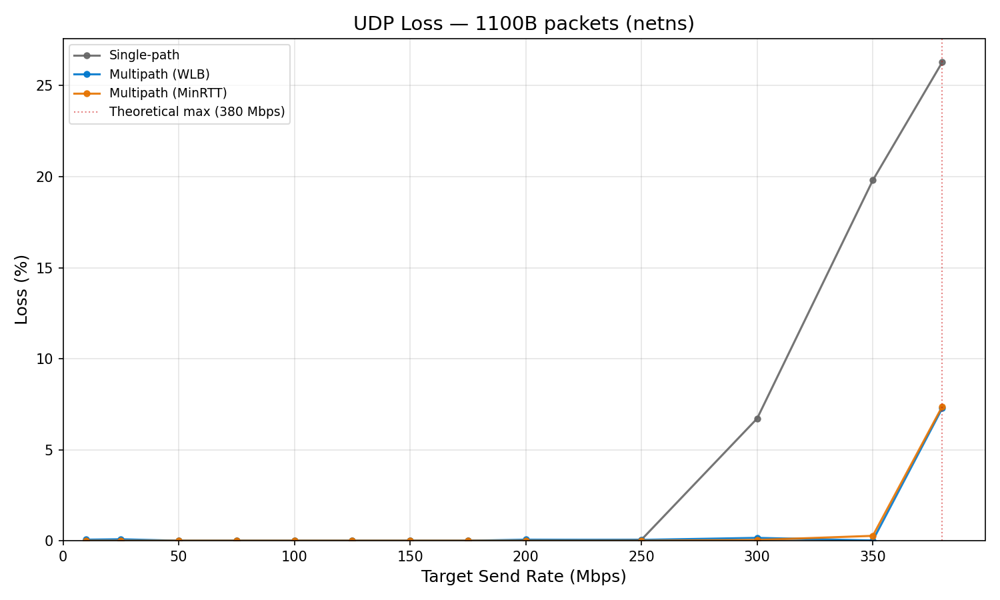
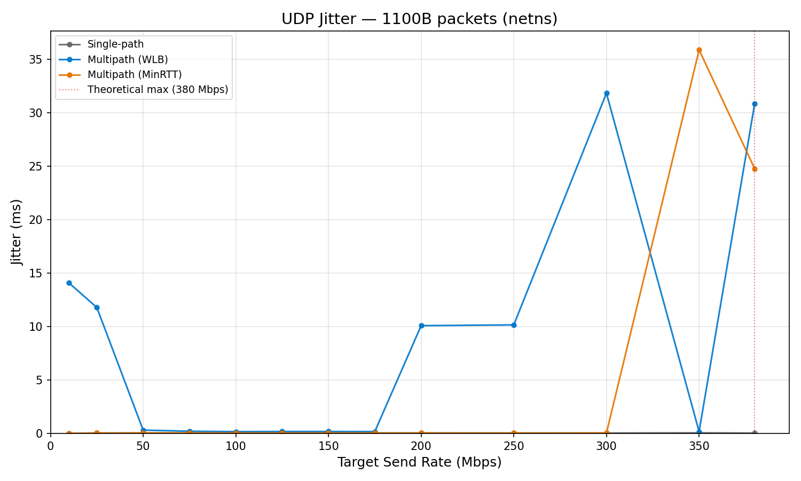
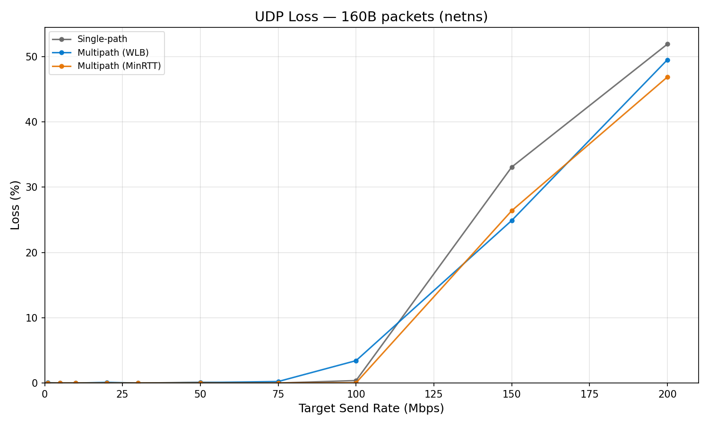

# mqvpn Benchmark Report (netns)

Asymmetric dual-path environment emulated with Linux network namespaces and tc netem.

| Path | Rate | Delay |
|------|:---:|:---:|
| Path A (primary) | 300 Mbit | 10ms |
| Path B (secondary) | 80 Mbit | 30ms |
| **Combined theoretical max** | **380 Mbps** | — |

## 1. Failover — Zero Downtime on Either Path Failure

WLB scheduler achieves zero downtime regardless of which path fails. Traffic seamlessly shifts to the surviving path.

### Path A failure (primary, 300 Mbit)



**0 downtime** — traffic instantly shifts to Path B at t=20s.

| Phase | Throughput (avg) | Detail |
|-------|:---:|--------|
| Pre-fault (t=0–19.5s) | 276 Mbps | Dual-path, both paths active |
| Degraded (t=20–40s) | 73 Mbps | Path B capacity only |
| Recovery (t=40–50s) | 71 Mbps | Path A revalidated, traffic redistributed |
| Post-recovery (t=50–60s) | 290 Mbps | Full dual-path restored |

### Path B failure (secondary, 80 Mbit)



**0 downtime** — minimal impact since Path A carries most traffic.

| Phase | Throughput (avg) | Detail |
|-------|:---:|--------|
| Pre-fault (t=0–19.5s) | 274 Mbps | Dual-path, both paths active |
| Degraded (t=20–40s) | 264 Mbps | Path A capacity (barely noticeable dip) |
| Post-recovery (t=50–60s) | 277 Mbps | Full dual-path restored |

Losing the secondary path has almost no visible impact on throughput in this case.

## 2. Bandwidth Aggregation — WLB vs MinRTT



WLB distributes TCP flows across paths proportional to capacity. MinRTT sends all packets on the lowest-latency path, leaving the secondary path underutilized.

| Streams | MinRTT (Mbps) | WLB (Mbps) | WLB vs MinRTT | WLB % of Max |
|:---:|:---:|:---:|:---:|:---:|
| 1 | 264 | 256 | -3% | 67% |
| 4 | 255 | 277 | **+9%** | 73% |
| 8 | 270 | 306 | **+13%** | 81% |
| 16 | 263 | **319** | **+21%** | **84%** |
| 32 | 289 | 310 | +7% | 82% |

- WLB peak: **319 Mbps** — 84% of theoretical max (380 Mbps)
- MinRTT peak: **289 Mbps** — 76% of theoretical max
- MinRTT always selects the lowest-latency path (Path A: 300M/10ms) for every packet, so Path B (80M/30ms) remains mostly idle even when available

## 3. UDP Rate Sweep — Loss & Jitter under Increasing Load

UDP benchmarks sweep send rate to find the saturation point and compare loss/jitter behavior across schedulers.

- **Bulk** (1100B payload): rate sweep 10–380 Mbps
- **VoIP** (160B payload): rate sweep 1–200 Mbps
- Duration: 15s per rate point

### 3.1 Bulk (1100B) — Saturation Point Shift




Multipath clearly shifts the saturation point upward compared to single-path.

| Condition | Saturation point | Loss at 350 Mbps | Loss at 380 Mbps |
|-----------|:---:|:---:|:---:|
| Single-path | ~280 Mbps | 6.71% | — |
| Multipath WLB | ~350 Mbps | 0.01% | 7.27% |
| Multipath MinRTT | ~350 Mbps | 0.27% | 7.37% |

Single-path saturates around 280 Mbps (Path A capacity), while both multipath schedulers push saturation to ~350 Mbps — a ~1.25x improvement consistent with the TCP aggregation results.

**Jitter: WLB shows instability.** WLB jitter is 10–30ms across most rates, while MinRTT stays below 0.05ms up to 300 Mbps. WLB distributes packets across paths with different RTTs (10ms vs 30ms), and the resulting reordering translates directly into jitter. MinRTT avoids this by keeping all packets on the lowest-latency path.

### 3.2 VoIP (160B) — Small Packet Overhead




At high packet rates, WLB multipath shows roughly the same loss as single-path — adding a second path provides no improvement. The bottleneck is **pps (packets per second)**, not bandwidth.

The same 100 Mbps represents very different CPU loads depending on packet size:

| Payload | 100 Mbps = | Ratio |
|---------|:---:|:---:|
| 1100B (bulk) | ~11,000 pps | 1x |
| 160B (VoIP) | ~78,000 pps | 7x |

Adding paths increases network capacity, but per-packet processing runs on a single thread regardless of path count:

```
Per packet (single-threaded):
  TUN read()           ← CPU-bound
  MASQUE encapsulation ← CPU-bound
  QUIC Datagram build  ← CPU-bound
  TLS 1.3 encryption   ← CPU-bound
  UDP sendto()         ← only this benefits from multiple paths
```

When the CPU saturates on per-packet overhead, multipath cannot improve throughput — the extra path capacity goes unused. Additionally, WLB distributes packets across paths with different RTTs (10ms vs 30ms), causing reordering that iperf3 counts as loss. MinRTT tends to keep packets on the lowest-RTT path, reducing the chance of cross-path reordering.

This is fundamentally a userspace packet processing limit. AF_XDP offload (bypassing the kernel network stack) would address this by reducing per-packet syscall overhead.

### 3.3 Scheduler Trade-off Summary

| | WLB | MinRTT |
|---|---|---|
| **Strength** | TCP throughput maximization | Low jitter, low loss for UDP |
| **Weakness** | High jitter under multipath (RTT gap → reordering) | Underutilizes secondary path |
| **Best for** | Bulk transfers, file downloads | VoIP, gaming, real-time streams |

WLB is optimized for aggregate TCP throughput — it distributes flows proportional to path capacity. For UDP, the RTT difference between paths (10ms vs 30ms) causes packet reordering that manifests as jitter. This is a design trade-off, not a bug: TCP absorbs reordering in its receive buffer, UDP does not.

**Recommendation:** Use MinRTT for latency-sensitive UDP workloads. Use WLB when maximizing aggregate throughput is the priority.

## Test Conditions

| Parameter | Value |
|-----------|-------|
| Environment | Linux network namespace (netns) |
| Path emulation | tc netem |
| Congestion control | BBR2+ |

### Failover

```
iperf3 -c <tunnel_ip> -t 60 -P 4 --interval 0.5 --json
```

- Fault injection at t=20s: `ip netns exec <server_ns> ip link set <path_if> down`
- Fault recovery at t=40s: `ip netns exec <server_ns> ip link set <path_if> up`

### Aggregate

```
iperf3 -c <tunnel_ip> -t 10 -P <streams> --json
```

- Streams sweep: 1, 2, 4, 8, 16, 32, 64
- Each stream count measured twice: single-path (Path A only) and multipath (Path A + B)

### UDP Sweep

```
iperf3 -u -c <tunnel_ip> -b <rate>M -l <pkt_size> -t 15 --json
```

- Packet sizes: 1100B (bulk), 160B (VoIP)
- 3 conditions: single-path (Path A), multipath WLB, multipath MinRTT
- TUN MTU: 1182 (1100B payload fits within tunnel capacity: 1100 + 28 = 1128 < 1182)
