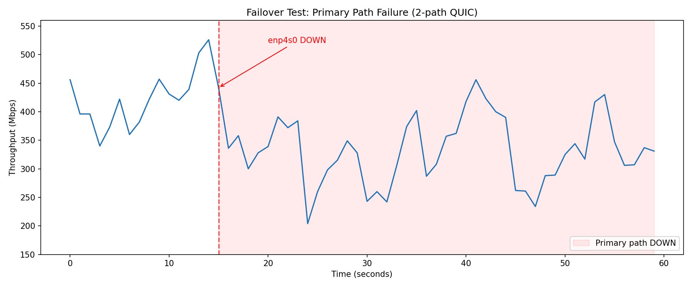

# mpvpn Benchmark Report(EC2)

Environment: Local machine (2x ISP: 10Gbps(NIC:enp4s0, primary path) + 1Gbps(NIC:enp5s0, secondly path)) → EC2 c6in.large (Tokyo, up to 25 Gbps burst)

Protocol: MASQUE CONNECT-IP (RFC 9484) over HTTP/3

## TCP Throughput (iperf3 TCP, 30s)

| Test | Direction | Mbps |
|------|-----------|------|
| Direct (no VPN) | UL | 825 |
| Direct (no VPN) | DL | 647 |
| 1-path mpvpn | UL | 361 |
| 1-path mpvpn | DL | 475 |
| 2-path mpvpn | UL | 419 |
| 2-path mpvpn | DL | 342 |

## UDP Throughput (iperf3 UDP, Bandwidth Sweep)

iperf3 UDP at increasing target rates (10s each). Max bandwidth with loss < 1%:

### Summary

| Test | Direction | Max Mbps (loss < 1%) |
|------|-----------|----------------------|
| Direct (no VPN) | UL | 1000 |
| Direct (no VPN) | DL | 1000 |
| 1-path mpvpn | UL | 700 (0.82%) |
| 1-path mpvpn | DL | 700 (0%) |
| 2-path mpvpn | UL | 600 (0.42%) |
| 2-path mpvpn | DL | 600 (0.001%) |

### Sweep Details

**Direct (no VPN) UL:**

| Rate | Mbps | Loss |
|------|------|------|
| 100M | 100 | 0.00% |
| 200M | 200 | 0.001% |
| 300M | 300 | 0.00% |
| 500M | 499 | 0.005% |
| 700M | 699 | 0.015% |
| 1000M | 998 | 0.15% |

**Direct (no VPN) DL:**

| Rate | Mbps | Loss |
|------|------|------|
| 100M | 100 | 0.00% |
| 200M | 200 | 0.00% |
| 300M | 300 | 0.00% |
| 500M | 500 | 0.001% |
| 700M | 700 | 0.018% |
| 1000M | 997 | 0.26% |

**1-path mpvpn (iperf3 UDP) UL:**

| Rate | Mbps | Loss | Jitter |
|------|------|------|--------|
| 10M | 10.0 | 0.00% | 0.22ms |
| 30M | 30.0 | 0.00% | 0.13ms |
| 50M | 50.0 | 0.00% | 0.06ms |
| 100M | 100 | 0.00% | 0.08ms |
| 150M | 150 | 0.00% | 0.06ms |
| 200M | 200 | 0.00% | 0.05ms |
| 300M | 300 | 0.002% | 0.03ms |
| 400M | 400 | 0.016% | 0.01ms |
| 500M | 499 | 0.026% | 0.01ms |
| 550M | 549 | 0.027% | 0.00ms |
| 600M | 598 | 0.19% | 0.03ms |
| 700M | 694 | 0.82% | 0.01ms |

**1-path mpvpn (iperf3 UDP) DL:**

| Rate | Mbps | Loss | Jitter |
|------|------|------|--------|
| 10M | 10.0 | 0.00% | 0.20ms |
| 30M | 30.0 | 0.00% | 0.13ms |
| 50M | 50.0 | 0.00% | 0.05ms |
| 100M | 100 | 0.00% | 0.02ms |
| 150M | 150 | 0.00% | 0.02ms |
| 200M | 200 | 0.00% | 0.07ms |
| 300M | 300 | 0.00% | 0.01ms |
| 400M | 400 | 0.010% | 0.02ms |
| 500M | 500 | 0.001% | 0.01ms |
| 550M | 550 | 0.000% | 0.01ms |
| 600M | 600 | 0.00% | 0.01ms |
| 700M | 700 | 0.00% | 0.01ms |

**2-path mpvpn (iperf3 UDP) UL:**

| Rate | Mbps | Loss | Jitter |
|------|------|------|--------|
| 10M | 10.0 | 0.00% | 0.27ms |
| 30M | 30.0 | 0.00% | 0.17ms |
| 50M | 50.0 | 0.00% | 0.11ms |
| 100M | 100 | 0.00% | 0.06ms |
| 150M | 150 | 0.00% | 0.05ms |
| 200M | 200 | 0.00% | 0.05ms |
| 300M | 300 | 0.00% | 0.02ms |
| 400M | 400 | 0.00% | 0.02ms |
| 500M | 499 | 0.016% | 0.00ms |
| 550M | 549 | 0.11% | 0.01ms |
| 600M | 597 | 0.42% | 0.01ms |
| 700M | 690 | 1.4% | 0.07ms |

**2-path mpvpn (iperf3 UDP) DL:**

| Rate | Mbps | Loss | Jitter |
|------|------|------|--------|
| 10M | 10.0 | 0.00% | 0.11ms |
| 30M | 30.0 | 0.003% | 0.08ms |
| 50M | 50.0 | 0.00% | 0.08ms |
| 100M | 99.8 | 0.19% | 0.04ms |
| 150M | 150 | 0.00% | 0.05ms |
| 200M | 200 | 0.00% | 0.05ms |
| 300M | 300 | 0.00% | 0.04ms |
| 400M | 400 | 0.055% | 0.02ms |
| 500M | 500 | 0.012% | 0.01ms |
| 550M | 550 | 0.00% | 0.06ms |
| 600M | 600 | 0.001% | 0.01ms |
| 700M | 657 | 6.0% | 0.01ms |

## Port 443 Test

MASQUE CONNECT-IP over HTTP/3 on standard HTTPS port (UDP 443):

| Test | Direction | Mbps | Result |
|------|-----------|------|--------|
| 1-path mpvpn, port 443 | UL | 361 | **PASS**|
| 1-path mpvpn, port 443 | DL | 485 | **PASS**|

## Failover Test

60-second iperf3 (TCP UL) with primary path (enp4s0) taken down at t≈15s. 2-path mpvpn connection (enp4s0 + enp5s0).

```
t=  0s:  456 Mbps
t=  1s:  396 Mbps
t=  2s:  396 Mbps
t=  3s:  340 Mbps
t=  4s:  373 Mbps
t=  5s:  422 Mbps
t=  6s:  360 Mbps
t=  7s:  382 Mbps
t=  8s:  422 Mbps
t=  9s:  457 Mbps
t= 10s:  431 Mbps
t= 11s:  420 Mbps
t= 12s:  439 Mbps
t= 13s:  503 Mbps
t= 14s:  526 Mbps
t= 15s:  442 Mbps  <-- primary path DOWN
t= 16s:  336 Mbps
t= 17s:  358 Mbps
t= 18s:  300 Mbps  <-- failover dip
t= 19s:  328 Mbps
t= 20s:  339 Mbps
t= 21s:  391 Mbps
t= 22s:  372 Mbps
t= 23s:  384 Mbps
t= 24s:  204 Mbps  <-- recovery
t= 25s:  260 Mbps
t= 26s:  298 Mbps
t= 27s:  315 Mbps
t= 28s:  349 Mbps
t= 29s:  328 Mbps
t= 30s:  243 Mbps
t= 31s:  260 Mbps
t= 32s:  242 Mbps
t= 33s:  306 Mbps
t= 34s:  374 Mbps
t= 35s:  402 Mbps
t= 36s:  287 Mbps
t= 37s:  308 Mbps
t= 38s:  357 Mbps
t= 39s:  362 Mbps
t= 40s:  418 Mbps
t= 41s:  456 Mbps
t= 42s:  423 Mbps
t= 43s:  400 Mbps
t= 44s:  390 Mbps
t= 45s:  262 Mbps
t= 46s:  261 Mbps
t= 47s:  234 Mbps
t= 48s:  288 Mbps
t= 49s:  289 Mbps
t= 50s:  325 Mbps
t= 51s:  344 Mbps
t= 52s:  317 Mbps
t= 53s:  417 Mbps
t= 54s:  430 Mbps
t= 55s:  347 Mbps
t= 56s:  306 Mbps
t= 57s:  307 Mbps
t= 58s:  337 Mbps
t= 59s:  331 Mbps
```

- Before failover (t=0-14): avg 416 Mbps
- Failover transition (t=15-19): avg 353 Mbps
- Secondary path only (t=20-59): avg 330 Mbps
- **Result: PASS — zero downtime, throughput maintained throughout primary path failure**
- Overall: 355 Mbps avg, iperf3 exit code 0

## Stability Test (30min UL + 30min DL)

1-path mpvpn, iperf3 TCP, 1800s per direction:

### UL (30 minutes)

| Minute | Mbps | Retrans |
|--------|------|---------|
| 1 | 383 | 656 |
| 2 | 391 | 395 |
| 3 | 372 | 506 |
| 4 | 388 | 587 |
| 5 | 369 | 551 |
| 6 | 379 | 492 |
| 7 | 361 | 578 |
| 8 | 366 | 393 |
| 9 | 380 | 588 |
| 10 | 377 | 546 |
| 11 | 381 | 438 |
| 12 | 379 | 552 |
| 13 | 387 | 543 |
| 14 | 373 | 571 |
| 15 | 377 | 514 |
| 16 | 387 | 514 |
| 17 | 378 | 587 |
| 18 | 383 | 304 |
| 19 | 389 | 524 |
| 20 | 382 | 527 |
| 21 | 385 | 407 |
| 22 | 422 | 456 |
| 23 | 400 | 650 |
| 24 | 396 | 348 |
| 25 | 386 | 435 |
| 26 | 386 | 489 |
| 27 | 363 | 479 |
| 28 | 365 | 438 |
| 29 | 391 | 308 |
| 30 | 384 | 530 |

| Metric | Value |
|--------|-------|
| Duration | 1800s (30 min) |
| Avg throughput | 382 Mbps |
| Min throughput | 361 Mbps |
| Max throughput | 422 Mbps |
| Total retransmits | 14,906 |

### DL (30 minutes)

| Minute | Mbps |
|--------|------|
| 1 | 479 |
| 2 | 459 |
| 3 | 514 |
| 4 | 509 |
| 5 | 484 |
| 6 | 505 |
| 7 | 479 |
| 8 | 498 |
| 9 | 496 |
| 10 | 494 |
| 11 | 461 |
| 12 | 480 |
| 13 | 495 |
| 14 | 488 |
| 15 | 451 |
| 16 | 475 |
| 17 | 504 |
| 18 | 474 |
| 19 | 466 |
| 20 | 453 |
| 21 | 463 |
| 22 | 474 |
| 23 | 496 |
| 24 | 481 |
| 25 | 474 |
| 26 | 485 |
| 27 | 470 |
| 28 | 490 |
| 29 | 486 |
| 30 | 486 |

| Metric | Value |
|--------|-------|
| Duration | 1800s (30 min) |
| Avg throughput | 482 Mbps |
| Min throughput | 451 Mbps |
| Max throughput | 514 Mbps |
| Total retransmits | 9,708 |

### Memory & CPU (combined UL + DL, 60 min total)

| Phase | RSS Start | RSS End | Growth | CPU |
|-------|-----------|---------|--------|-----|
| UL (30 min) | 8,788 KB | 8,936 KB | +148 KB | ~45% |
| DL (30 min) | 8,936 KB | 8,936 KB | 0 KB | ~38% |

- **Result: PASS — stable throughput in both directions, negligible memory growth over 1 hour**
- No throughput drops below 200 Mbps in either direction
- Memory stable at ~8.9 MB across the entire test

## Implementation Notes

- `cong_ctrl_callback = xqc_bbr_cb` is enabled on both client and server.
- Pacing is enabled and send queue/socket buffer were increased for throughput headroom.

## Known Issues

1. **2-path mpvpn DL lower than 1-path**: 2-path DL (342 Mbps) is lower than 1-path DL (475 Mbps). MinRTT scheduler selects only the lowest-RTT path each packet sending, so the second path adds overhead without bandwidth aggregation.

2. **Multipath secondary path idle timeout**: When using 2 paths with MinRTT scheduler, the non-preferred path may time out due to receiving no traffic. `mp_ping_on = 1` mitigates this but does not fully solve it.

3. **Split tunneling + multipath routing conflict**: Requires per-source policy routing as workaround.
