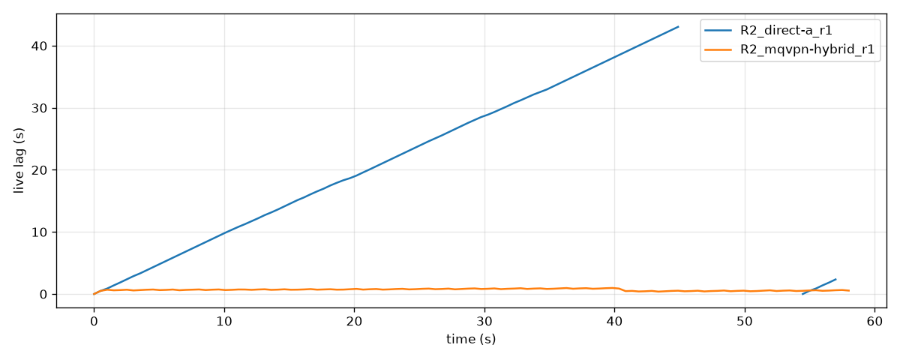
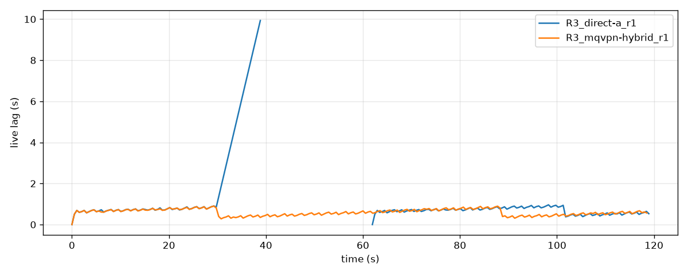

# RTMP 配信の回線ボンディング測定 (direct vs mqvpn)

日付: 2026-08-11。
対象バージョン: mqvpn v0.16.0。

## RTMP は 1 本の回線に縛られる

イベント中継や屋外からのライブ配信では、モバイル回線 1 本に配信の成否がかかる。
RTMP は YouTube Live や Twitch など主要サービスが受け付ける最も普及した配信プロトコルだが、1 本の TCP 接続で送る仕組みのため、回線が不安定になれば配信はそのまま乱れ、回線が切れれば配信も切れる。

複数の回線を同時に使って 1 本の配信を支える手法は**ボンディング** (bonding) と呼ばれる。
ただし RTMP 自体にはボンディングの仕組みがない。
商用機材でもこの制約は変わらず、たとえば LiveU のヘルプは、機材から RTMP を直接送るモードでは複数回線を束ねられないと明記している[^liveu]。
束ねたい場合は専用プロトコルで同社のクラウドへ送り、クラウド側で RTMP に変換して配信先へ届ける構成になる。

mqvpn を使うと、この変換や専用クラウドなしで RTMP をボンディングできる。
配信ソフトから見えるのは普通の RTMP サーバであり、配信先から見えるのは普通の RTMP クライアントで、回線を束ねる作業はすべてトンネルの内側で行われる。
配信ソフト (OBS など) の変更は接続先アドレスのみで、配信先サービス側の対応は不要である。

本レポートでは、この構成の効果を再現可能な擬似ネットワーク上で測定した。
比較したのは **direct** (単一回線に直接 RTMP) と **mqvpn** (2 回線をトンネルで束ねて RTMP) の 2 構成である。
結論を先に示す。

- 弱い回線 2 本の束ね: 単独では 8 Mbps を送れない回線 (6 Mbps × 2 本) で、direct は 5.7 Mbps に頭打ちになり、60 秒の配信でライブから約 17 秒遅れた。mqvpn は 7.8 Mbps を維持し、遅れは 1 秒未満に収まった。
- 不安定な回線での安定性: モバイル回線を模した間欠的なパケット損失の下で、direct は 60 秒間に平均 4 回切断し、実質配信不能 (0.9 Mbps) になった。mqvpn は切断 0 回、停止 0 秒、7.9 Mbps を維持した。
- 回線断への耐性: 配信中に片方の回線を 30 秒間遮断すると、direct の配信は約 33 秒止まった。mqvpn は切断 0 回、停止 0 秒で配信が続いた。

## 測定環境

実回線では電波状況を制御も再現もできないため、Linux のネットワーク名前空間と netem を使った擬似ネットワーク上で測定した。

- 配信元と配信先 (RTMP サーバ) を 2 本の仮想回線で接続し、帯域、遅延、損失を条件ごとに設定する
- 配信は 1080p30、映像 8 Mbps と音声 160 kbps。Twitch の上限や YouTube の 1080p 推奨帯に相当する実用レートである
- 配信ソフトの挙動は OBS に合わせた。10 秒間送信が進まなければ切断と見なし、2 秒間隔で再接続を試みる
- 各条件で 60 秒または 120 秒の配信を 3 回繰り返し、平均を報告する

条件は次の 3 つである。

| 条件 | 回線 A | 回線 B | 想定する状況 |
|---|---|---|---|
| (1) 弱い回線の束ね | 6 Mbps、遅延 20 ms | 6 Mbps、遅延 20 ms | どちらか 1 本では 8 Mbps を送れない |
| (2) バースト損失 | 100 Mbps、遅延 50 ms、間欠損失[^gemodel] | 100 Mbps、遅延 50 ms | 電波状況の悪いモバイル回線 |
| (3) 回線断 | 12 Mbps、遅延 10 ms | 12 Mbps、遅延 30 ms | 開始 30 秒後に回線 A を遮断し、その 30 秒後に復旧 |

指標は次の 4 つで、いずれも配信を見る側の体験に対応する。

- **切断回数**：配信ソフトが再接続を強いられた回数
- **配信停止時間**：配信が始まったあと、配信先へのデータ到達が 1 秒を超えて途絶えた時間の合計 (視聴者には映像の停止として見える)。配信開始直後の立ち上がり空白 (どの構成にも共通して現れる約 1 秒) は含めない[^deadair]
- **ライブからの遅れ**：送信が詰まって配信が実時間からどれだけ遅れたか
- **届いたビットレート**：配信先が実際に受信したレート (停止時間を除いた平均。したがって「配信できていた瞬間の質」を表し、停止の長さは配信停止時間の側に現れる)

## 結果 1: 弱い回線 2 本を束ねる

| | direct | mqvpn |
|---|---|---|
| 届いたビットレート | 5.7 Mbps | 7.8 Mbps |
| ライブからの遅れ (最大) | 16.9 秒 | 0.9 秒 |
| 切断回数 | 0 回 | 0 回 |

direct は回線 A の物理限界 (6 Mbps) に頭打ちになり、送りきれない分が積み上がって 60 秒で約 17 秒の遅れになった。
ライブ配信で 17 秒の遅れは、コメントへの応答が成立しなくなる水準である。
mqvpn は 2 本の合算帯域で 8 Mbps の配信をそのまま運び、遅れは 1 秒未満に収まった。

## 結果 2: 不安定な回線で配信を保つ

| | direct | mqvpn |
|---|---|---|
| 切断回数 | 4.0 回 | 0 回 |
| 配信停止時間 (60 秒中) | 41.8 秒 | 0 秒 |
| ライブからの遅れ (最大) | 43.0 秒 | 1.0 秒 |
| 届いたビットレート | 0.9 Mbps | 7.9 Mbps |

TCP はパケット損失が続くと再送を重ねて送信が詰まる。
direct ではこの詰まりが繰り返し切断判定 (10 秒) を超え、60 秒のうち 42 秒間、配信先に何も届かなかった。
mqvpn では、損失からの回復をトンネルが回線ごとに引き受けるため、配信ソフトには安定した通り道だけが見える。
3 回の繰り返しすべてで切断 0 回、停止 0 秒、7.9 Mbps という同じ結果になった (1 秒未満の到達の揺らぎも最大 0.5 秒程度にとどまった)。



グラフは送信側から見た遅れの推移で、線が途切れている区間は配信ソフトの接続が切れていた時間である。

## 結果 3: 配信中に回線が切れても止まらない

| | direct | mqvpn |
|---|---|---|
| 切断回数 | 8.7 回 | 0 回 |
| 配信停止時間 (120 秒中) | 32.9 秒 | 0 秒 |
| 回線復旧から配信再開までの時間 | 30.6 秒 | 該当なし (停止しない) |
| 届いたビットレート | 8.0 Mbps | 8.1 Mbps |

direct のビットレートが mqvpn と並んでいるのは、この指標が停止時間を除いた平均だからである (残った 12 Mbps 回線は 8 Mbps の配信に十分で、届いている間の質は落ちない)。
差はビットレートではなく、約 33 秒の停止と 8.7 回の切断に現れている。

direct では、回線と一緒に配信の TCP 接続も死ぬ。
配信ソフトは再接続を試み続けるが、同じ回線しかないため回線自体が復旧するまで失敗し続け、遮断の 30 秒間 (と検知や再接続の数秒) がそのまま配信停止になる。
mqvpn は残った回線 B へ即座に切り替え、配信ソフトの接続は一度も切れない。
この挙動は 3 回の繰り返しすべてで同じだった。



mqvpn の線が途切れていないのは、接続が一度も切れていないからである。
停止 0 秒は測定分解能の裏付けもある。
遮断の前後で、受信側のバイト到達の間隔が監視の 1 サンプル分 (250 ms) を超えることは、3 回の繰り返しを通じて一度もなかった。
回線 A の遮断も復旧も、受信側からは検出できないほど滑らかに処理されている。

実映像 (Big Buck Bunny[^bbb]) を配信した比較動画も同条件で収録した。
direct 側は 32.8 秒の「signal lost」表示 (実測の停止時間と一致する) になり、mqvpn 側は途切れず再生が続く。

- [動画: 条件 3 の並列比較 (direct vs mqvpn)](../../bench_results/rtmp/video/r3_flap_direct_vs_mqvpn.mp4)
- [動画: 条件 1 の並列比較](../../bench_results/rtmp/video/r1_starved_direct_vs_mqvpn.mp4)

## 設定方法

RTMP のような TCP ベースのプロトコルでは、トンネルの hybrid TCP レーンを有効にする。
クライアント側の設定は次の 2 行である。

```ini
[Hybrid]
Enabled = true
Tcp = stream
```

サーバ側は、同じ設定に加えて配信先アドレスの許可を与える。

```ini
[Hybrid]
Enabled = true
Tcp = stream
EgressAllow = <配信先のアドレス範囲>
```

## 制約と再現方法

数値は擬似ネットワーク上のものであり、実回線では電波状況や事業者の設備により変動する。
測定条件と手順はすべてリポジトリに含まれており、`scripts/benchmark_rtmp.sh` (数値測定) と `scripts/benchmark_rtmp_video.sh` (実映像) を root 権限で実行すれば再現できる。
集計データと生データの一覧は `bench_results/rtmp/` にある。
UDP ベースの配信プロトコル (SRT) についての同種の測定は、既存の SRT レポート (`bench_results/srt/REPORT.md`) を参照のこと。

[^liveu]: What Is RTMP Direct Mode? (LiveU Solo ヘルプセンター) <https://solohelp.liveu.tv/hc/en-us/articles/13949406405403-What-Is-RTMP-Direct-Mode>。"When selecting to stream via RTMP directly from the LiveU Solo unit, the unit cannot bond multiple connections." とある。
[^gemodel]: netem の Gilbert-Elliott モデル (パラメータ 4% 30% 80% 0.5%) による、平均約 10% の間欠的なパケット損失。良好な区間と高損失の区間が交互に現れる、モバイル回線に典型的な損失パターンを模す。
[^deadair]: 受信側 (RTMP サーバ) の録画ファイルのバイト増加を 250 ms 間隔で監視し、1 秒を超えて増加が止まった時間を停止と判定した。送信ソフトが動いていても配信先にデータが届いていなければ停止に数える。エンコーダが最初の映像を送り出すまでの立ち上がり空白 (約 1 秒、全構成共通) は配信中の停止ではないため本文の表からは除いた。リポジトリの集計データ (`bench_results/rtmp/results_tier1.csv`) はこの立ち上がりを含む生の値であり、本文より約 1 秒大きい。判定の実装は `benchmarks/rtmp_analyze.py` を参照。
[^bbb]: Big Buck Bunny © Blender Foundation (CC-BY 3.0) <https://peach.blender.org/>
